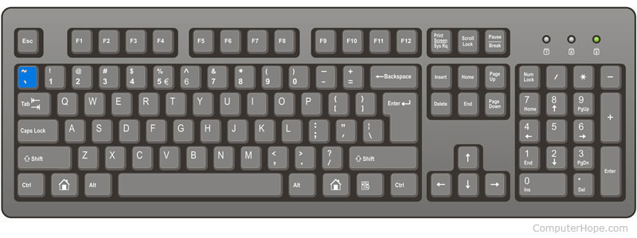
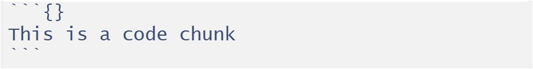

```{=html}

<style type="text/css">

/* Cascading Style Sheets (CSS) is a stylesheet language used to describe the presentation of a document written in HTML or XML. it is a simple mechanism for adding style (e.g., fonts, colors, spacing) to Web documents. */

h1.title {  /* Title - font specifications of the report title */
  font-size: 24px;
  color: DarkRed;
  text-align: center;
  font-family: "Gill Sans", sans-serif;
  font-weight: bold;
}
h4.author { /* Header 4 - font specifications for authors  */
  font-size: 20px;
  font-family: system-ui;
  color: DarkRed;
  text-align: center;
  font-weight: bold;
}
h4.date { /* Header 4 - font specifications for the date  */
  font-size: 18px;
  font-family: system-ui;
  color: DarkBlue;
  text-align: center;
  font-weight: bold;
}
h1 { /* Header 1 - font specifications for level 1 section title  */
    font-size: 22px;
    font-family: "Times New Roman", Times, serif;
    color: navy;
    text-align: center;
  font-weight: bold;
}
h2 { /* Header 2 - font specifications for level 2 section title */
    font-size: 20px;
    font-family: "Times New Roman", Times, serif;
    color: navy;
    text-align: left;
  font-weight: bold;
}

h3 { /* Header 3 - font specifications of level 3 section title  */
    font-size: 18px;
    font-family: "Times New Roman", Times, serif;
    color: navy;
    text-align: left;
  font-weight: bold;
}

h4 { /* Header 4 - font specifications of level 4 section title  */
    font-size: 16px;
    font-family: "Times New Roman", Times, serif;
    color: darkred;
    text-align: left;
}

body { background-color:white; }

.highlightme { background-color:yellow; }

p { background-color:white; }

</style>
```

```{r setup, include=FALSE}
# Detect, install and load packages if needed.
if (!require("knitr")) {
   install.packages("knitr")
   library(knitr)
}
if (!require("leaflet")) {
   install.packages("leaflet")
   library(leaflet)
}
if (!require("EnvStats")) {
   install.packages("EnvStats")
   library(EnvStats)
}
if (!require("MASS")) {
   install.packages("MASS")
   library(MASS)
}
if (!require("phytools")) {
   install.packages("phytools")
   library(phytools)
}
#
# specifications of outputs of code in code chunks
knitr::opts_chunk$set(echo = FALSE,      # include code chunk in the output file
                      warnings = FALSE,  # sometimes, you code may produce warning messages,
                                         # you can choose to include the warning messages in
                                         # the output file. 
                      messages = FALSE,  #
                      results = TRUE     # you can also decide whether to include the output
                                         # in the output file.
                      )   
```


# Introduction

This brief note will introduce the basics of Rstudio, R Markdown, and R.

* **RStudio** is an integrated development environment (IDE) for R. It includes a console, syntax-highlighting editor that supports direct code execution, as well as tools for plotting, history, debugging, and workspace management.

* **R Markdown** is a file format for making dynamic documents with R. An R Markdown document is written in markdown (an easy-to-write plain text format) and contains chunks of embedded R code and the output generated from the R code. This note is written in R Markdown. This is also a tutorial showing how to use R Markdown to write an R Markdown report. – RStudio documentation.

* **R** is a language and environment for statistical computing and graphics. It is a GNU project which is similar to the S language and environment which was developed at Bell Laboratories (formerly AT&T, now Lucent Technologies) by John Chambers and colleagues. R can be considered as a different implementation of S. There are some important differences, but much code written for S runs unaltered under R.


# RStudio GUI

The RStudio interface consists of several windows. I insert an image of a regular RStudio GUI.

```

```

## Console

We can type commands directly into the console, or write in a text file, and then send the command to the console. It is convenient to use the console if your task involves one line of code. Otherwise, we should always use an editor to write code and then run the code in the Console. 

## Source Editor

Generally, we will want to write programs longer than a few lines. The Source Editor can help you open, edit and execute these programs.

## Environment Window

The Environment window shows the objects (i.e., data frames, arrays, values, and functions) in the environment (workspace). We can see the descriptive information such as types as the dimension of the objects in your environment. We also choose a data source from the environment to view in the source window like a spreadsheet. 


## System and Graphic files

The Files tab has a navigable file manager, just like the file system on your operating system. The Plot tab is where the graphics you create will appear. The Packages tab shows you the packages that are installed and those that can be installed (more on this just now). The Help tab allows you to search the R documentation for help and is where the help appears when you ask for it from the Console.

# R Markdown

An R Markdown document is a text-based file format that allows you to include both descriptive text, code blocks, and code output. It can be converted to other types of files such as PDF, HTML, and WORD that can include code, plots, outputs generated from the code chunks.

## Code Chunk

In R Markdown, we can embed R code in the code chunk defined by the symbol ` ```{} ` and closed by ` ``` `. The symbol ` ` `, also called **backquote** or **backtick**, can be found on the top left corner of the standard keyboard as shown in the following. 

```{r echo=FALSE, fig.align ="center", fig.cap="The location of backquote on the standard keyboard",  out.width = '60%',  dev="jpeg"}

```


There are two code chunks: executable and non-executable chunks.  The following code chunk is non-executable since is no argument specified in the ` {} `. 

```{r echo=FALSE, fig.align ="center", fig.cap="Non-executable code chunk.", fig.height=1,fig.width=3, dev="jpeg"}

```


```{}
This is a code chunk
```


To write a code chunk that will be executed, we can simply put the letter ` r ` inside the curly bracket. If the code chunk is executable, you will the green arrow on the top-right corner of the chunk.

```{r echo=FALSE, fig.align ="center", fig.cap="Executable code chunk.", fig.height=1,fig.width=3, dev="jpeg"}
include_graphics("Executable-code-chunk.jpg")
```

We can define R objects with and without any outputs. In the above R code chunk, we define an R object under the name `x` and assign value 5 to `x` (the first line of the code). We also request an output that prints the value of `x`. The above executable code chunk gives output ` [1] 5 ` in the Markdown document. The same output in the knit output files is in a box with a transparent background in the form `## [1] 5 `. 

```{r}
x = 5
x
```

We can also use an argument in the code chunk to control the output. For example, the following code chunk will be evaluated when kitting to other formats of files. But we can still click the green arrow inside the code chunk to evaluate the code.

```{r echo=FALSE, fig.align ="center", fig.cap="Executable code chunk with control options.", fig.height=1,fig.width=3, dev="jpeg"}
#include_graphics("ww01/Executable-code-chunk-argument.jpg")
```


```{r eval = FALSE}
x = 5
x
```


## Graphics Generated from R Code Chunks

In the previous sub-sections, we include images from external image files. In fact, can use the R function to generate graphics (other than interacting with plots, etc.) in the markdown file & knit. For instance, we can generate the following image from R and include it in the Markdown document and the knitter output files.


```{r, fig.align="center", fig.height=5, fig.width=5}
library(phytools)
data(anoletree)
plotTree(as.phylo(anoletree), type="fan", lwd=1, fsize=0.7)
```


# Collaborative Platforms

There are many platforms and technologies available for applied statisticians and data scientists. We will use RPubs (https://rpubs.com/) and GitHub Repository (https://github.com/) in this class.

## RPubs

**RPubs** is a free web server provided by RStudio (recently changed to **Posit**) that you can use it to publish you analytic reports and code and share with your peers and friends worldwide.

To use this resource, you need to sign up an account with RPubs first. Onece you set up your RPubs account, you can then create reports via RMarkdown and publish them on RPubs in the HTML format. You can share your work with people by providing the hyperlink to them.

In this class, all preject reports are required to be published on RPubs so I can read your work directly from RPubs. You need to submit the links to you reports via D2L dropbox.


## GitHub Repository

GitHub is an online software development platform. It's used for storing, tracking, and collaborating on software projects.

To use it, you need to create an account. After you set your GitHub account, you can upload your files (text, code, photos, videos, etc) to the repository. You can also use GitHub to host your personal web page (static). 

In this class, all data sets you are going to use in your assignments and project are required to uploaded to your specific repository so you can read your data sets directly from GitHub repository. 


## Correct URL of A GitHub File

The following figure shows how to find the correct URL of a file stored in a GitHub repository.

```{r fig.align='center', out.width="90%"}

```


